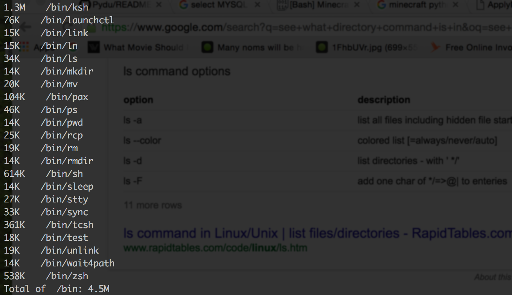

# Pydu & Pyducl
Estimate File Space Usage with Python in Command Line and in Python Code.
Works with Linux, Windows, and Mac

# Pydu
Pydu.py is the base object of Pydu. Pydu is a simple class to determine file size of files in a specific directory.

# Pyducl
Pyducl.py is the Command Line wrapper for Pydu.py 

Showing what it displays, (Human Readable Option)

